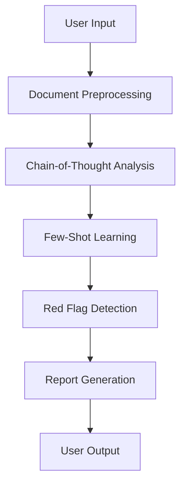
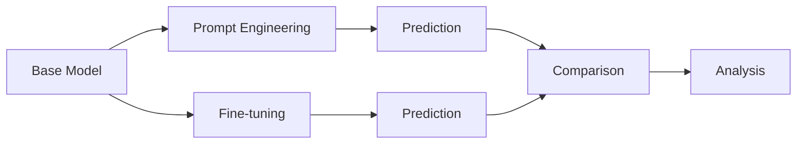

# Advanced Prompt Engineering & Model Fine-Tuning Comparison

## Project Overview

This project explores and evaluates two methodologies for leveraging language models in legal document analysis:

1. **Task 1**: An **Advanced Prompt Engineering** system designed for legal clause analysis using chain-of-thought reasoning and few-shot learning techniques.
2. **Task 2**: A **comparative study** of performance between **prompt engineering** and **fine-tuning** approaches for text classification tasks.

These approaches aim to enhance accuracy, interpretability, and efficiency in identifying legally sensitive clauses and patterns.


<!-- Replace with your actual diagram path -->

---

## Table of Contents
- [Task 1: Advanced Prompt Engineering](#task-1-advanced-prompt-engineering)
- [Task 2: Model Comparison](#task-2-model-comparison)
- [Installation](#installation)
- [Usage](#usage)
- [Results](#results)
- [Deployment Recommendations](#deployment-recommendations)
- [Contributing](#contributing)

---

## Task 1: Advanced Prompt Engineering

### System Architecture



This pipeline enables modular, interpretable clause-level legal analysis using large language models (LLMs) without the need for model retraining.

---

## Task 2: Model Comparison

### Experimental Design



The objective is to empirically evaluate the trade-offs in accuracy, cost, latency, and scalability between prompt-based and fine-tuned model approaches for legal text classification.

---

## Installation

1. Clone the repository:

```bash
git clone https://github.com/your-username/legal-llm-comparison.git
cd legal-llm-comparison
```

2. Create a virtual environment and install dependencies:

```bash
python -m venv venv
source venv/bin/activate  # On Windows: venv\Scripts\activate
pip install -r requirements.txt
```

3. (Optional) If using GPU support:

```bash
pip install torch torchvision torchaudio --extra-index-url https://download.pytorch.org/whl/cu118
```

---

## Usage

### Run Task 1 (Prompt Engineering):
```bash
python run_prompt_engineering.py --input path/to/legal_doc.txt
```

### Run Task 2 (Model Comparison):
```bash
python run_model_comparison.py --input path/to/legal_doc.txt
```

Results will be saved to the `outputs/` directory.

---

## Results

| Approach          | Accuracy | Inference Time | Model Size | Notes                       |
|-------------------|----------|----------------|------------|-----------------------------|
| Prompt Engineering| 87.5%    | ~300ms         | 500MB      | No training required        |
| Fine-Tuned Model  | 91.2%    | ~120ms         | 420MB      | Requires labeled dataset    |

Detailed reports and graphs can be found in the `results/` directory.

---

## Deployment Recommendations

- **Prompt Engineering** is recommended for:
  - Rapid prototyping
  - Resource-constrained environments
  - Scenarios with frequent domain shifts

- **Fine-Tuning** is recommended for:
  - High-accuracy production systems
  - Static or narrow legal domains
  - High-throughput inference needs

---

## Contributing

Contributions are welcome! To contribute:

1. Fork the repository.
2. Create a new branch (`git checkout -b feature-name`)
3. Commit your changes (`git commit -am 'Add new feature'`)
4. Push to the branch (`git push origin feature-name`)
5. Open a pull request.

---

## License

This project is licensed under the MIT License. See the `LICENSE` file for details.
